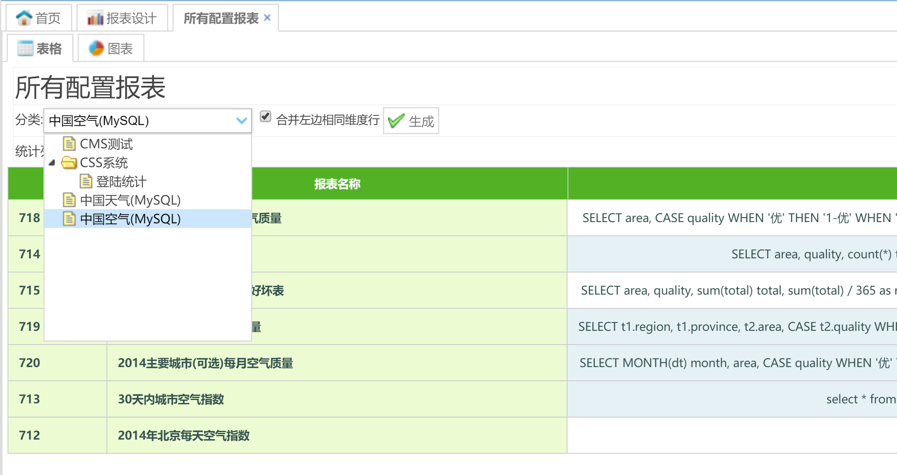
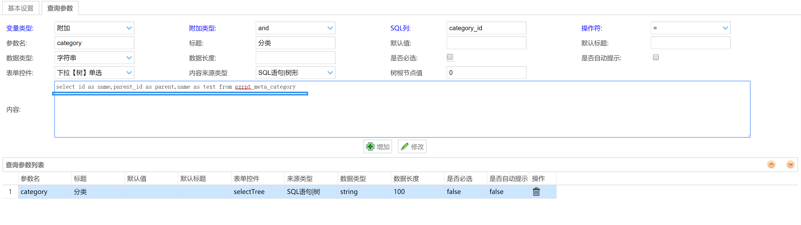

EasyReport
==========

为 https://github.com/xianrendzw/EasyReport 项目的一个改造版本

### 1、主要是利用 JSQLParser 改造 报表查询条件添加 查询条件附加功能

功能介绍请参看原项目介绍

改造效果

### 2、查询条件支持树形数据
对层级类数据，支持树形选择

SQL配置：注意，树根节点值要填

### 3、通过表达式列添加子报表
通过调整原设计中的**计算列**为 **表达式列** ,这样可以把该列当成模板列，比如：`max_temp>5?''+max_temp+'':''+max_temp+''` 或者跳转到另一个报表 `'<a href=/easyreport-web/report/uid/4e5716b2-11dd-4d9d-a1c1-7bc736cc0458?department_id='+ department_id +' target=_black >人员信息'+department_id+'</a>'` ,当然要跳入的报表参数名称必须与传参一致，具体实现可参考`PreviewController.preview` 和`src\main\webapp\assets\js\report\themes\content\table.js` 在 `initData`中新增的方法，跑起来试一试